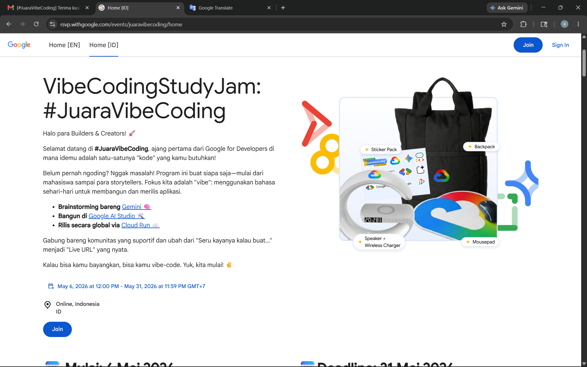
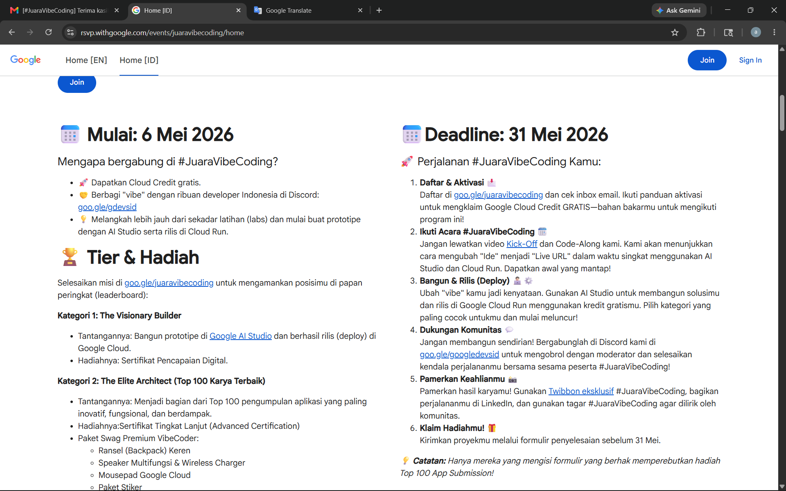
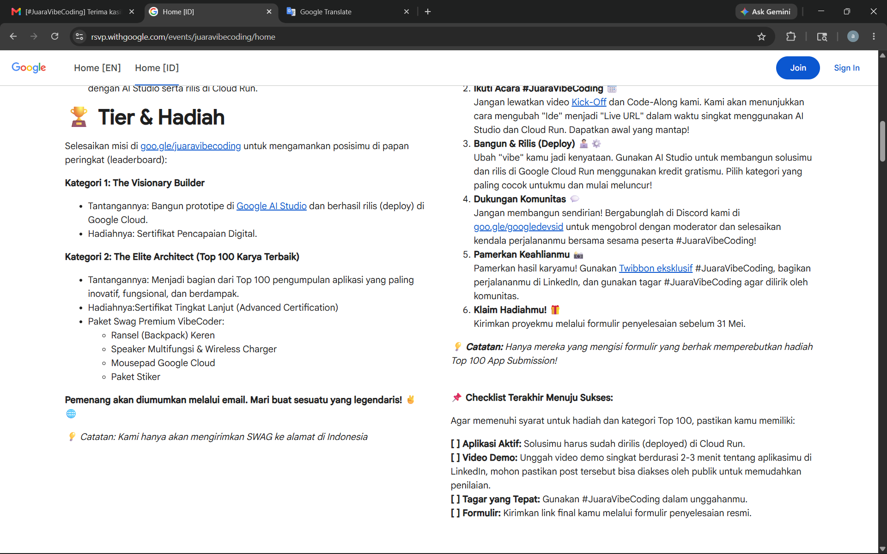
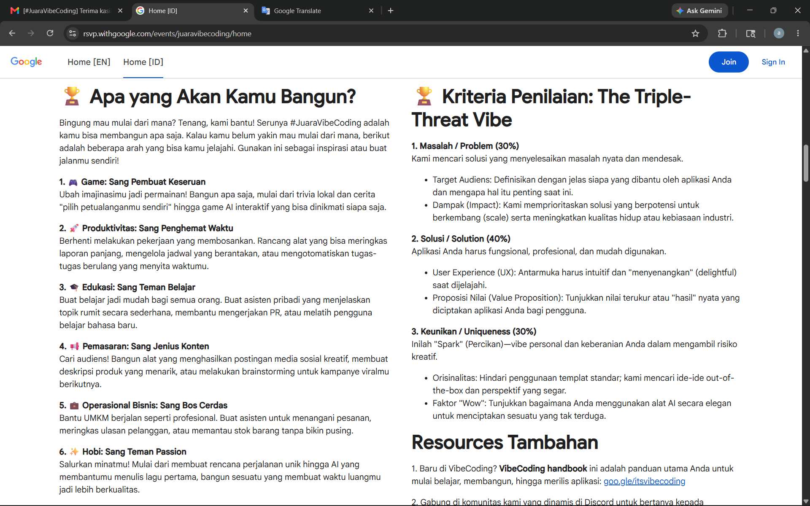
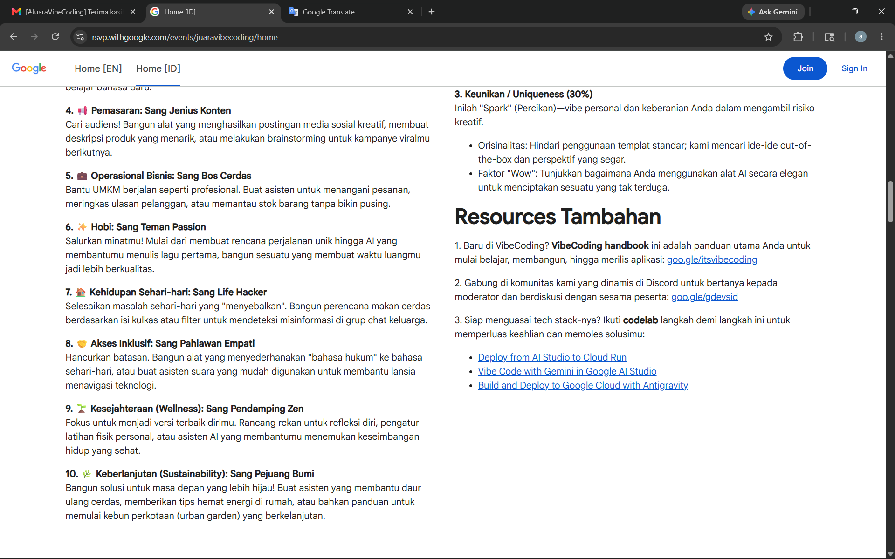

# SaringSini

[](https://github.com/SultanZhalifa/SaringSini/actions/workflows/ci.yml)
[](LICENSE)
[](CONTRIBUTING.md)
[](https://nodejs.org/)

**SaringSini** adalah proyek open-source Indonesia yang mengeksplorasi cara membantu keluarga menilai pesan mencurigakan dan membicarakan misinformasi tanpa memperkeruh hubungan. Aplikasi ini menyediakan indikasi awal berbantuan AI, template balasan yang lebih santun, simulasi percakapan keluarga, serta materi literasi digital.

Proyek ini masih berada pada tahap awal dan terutama ditujukan untuk pengembangan lokal, demonstrasi, pembelajaran, dan kontribusi komunitas. Hasil AI dapat tidak lengkap atau salah. SaringSini bukan layanan pemeriksa fakta resmi dan bukan pengganti pemeriksa fakta profesional atau sumber otoritatif.

## English overview

SaringSini is an early-stage Indonesian open-source project that explores AI-assisted assessment of suspicious family messages and more constructive ways to discuss misinformation. It can provide preliminary AI indications, draft respectful replies, and offer communication practice scenarios. Its output may be incomplete or wrong and must not be treated as authoritative fact-checking. The current repository is intended primarily for local development, demonstrations, learning, and community contribution.

The primary project language is Indonesian. International reviewers can use this overview together with the [setup](#menjalankan-secara-lokal), [limitations](#batasan-penting), [roadmap](ROADMAP.md), [support guide](SUPPORT.md), and [contribution guide](CONTRIBUTING.md).

## Tautan proyek

- [Roadmap](ROADMAP.md)
- [Dukungan dan pertanyaan](SUPPORT.md)
- [Panduan kontribusi](CONTRIBUTING.md)
- [Kebijakan keamanan](SECURITY.md)
- [Kode etik](CODE_OF_CONDUCT.md)
- [Changelog](CHANGELOG.md)
- [Lisensi MIT](LICENSE)

## Status demo

Belum ada live demo publik yang dipelihara oleh proyek. Cara yang tersedia untuk mencoba SaringSini adalah menjalankannya secara lokal. Screenshot berikut berasal dari demonstrasi aplikasi dan tidak membuktikan adopsi atau penggunaan produksi.

| Beranda | Periksa AI | Hasil Analisis |
|---|---|---|
|  |  |  |

| Simulator Chat | Komunitas |
|---|---|
|  |  |

> **Transparansi data demonstrasi:** angka keluarga terbantu, aktivitas langsung, leaderboard, target solidaritas, peringkat, dan sebaran wilayah di antarmuka adalah data sintetis untuk demonstrasi. Angka tersebut bukan metrik pengguna, adopsi, dampak, atau aktivitas produksi.

## Kemampuan saat ini

- Penilaian awal berbantuan Gemini untuk teks, screenshot, gambar/video, dan URL yang dikirim pengguna.
- Tiga variasi template balasan: sopan, santai, dan humor.
- Konversi template ke Bahasa Jawa Krama, Sunda Halus, Minang, dan Batak melalui Gemini.
- Simulasi percakapan keluarga dan latihan komunikasi berbantuan AI.
- Pengaturan nada balasan dari formal hingga santai.
- Feed komunitas demonstrasi dengan penyimpanan JSON lokal.
- Ekspor PNG/PDF, berbagi melalui WhatsApp, input suara melalui Web Speech API, dan PWA shell.
- Materi edukasi, kuis, dashboard, dan peta demonstrasi.

Istilah seperti penilaian media AI atau pemeriksaan URL dalam proyek ini berarti **indikasi awal yang dihasilkan model**, bukan analisis forensik tervalidasi, pemindaian keamanan jaringan, atau keputusan faktual resmi.

## Batasan penting

### Hasil AI

SaringSini meminta Gemini menghasilkan penilaian dan saran berdasarkan materi yang diberikan. Implementasi saat ini tidak melakukan pencarian sumber, retrieval, pemeriksaan silang otomatis, atau penyertaan sitasi. Karena itu:

- hasil dapat tidak lengkap, keliru, atau terlalu yakin;
- skor dan label merupakan keluaran model, bukan probabilitas yang telah dikalibrasi;
- indikasi media AI/deepfake bukan hasil laboratorium forensik;
- penilaian URL bukan pengganti pemeriksaan domain, sandbox, atau layanan keamanan khusus;
- klaim yang berpengaruh pada kesehatan, keuangan, keselamatan, atau hukum harus diverifikasi melalui sumber otoritatif.

### Privasi dan alur data

Perilaku berikut didasarkan pada implementasi saat ini:

- Teks, URL, riwayat coaching, template balasan, dan media yang dianalisis dikirim dari server ke layanan Gemini untuk menghasilkan respons.
- File upload dibatasi 5 MB dan diterima melalui penyimpanan in-memory Multer. Aplikasi tidak menulis file upload tersebut ke `data/community.json`.
- Setelah analisis, potongan teks pesan—atau klaim pertama yang dihasilkan AI ketika tidak ada teks—dapat otomatis ditambahkan ke feed komunitas demonstrasi.
- Feed tersebut, termasuk potongan teks, skor/label AI, jumlah dukungan, dan daftar UUID klien yang sudah mendukung suatu entri, ditulis ke `data/community.json` pada instance server.
- UUID klien dibuat dan disimpan di browser. Ketika pengguna mendukung entri komunitas, UUID itu juga dikirim ke server dan dapat disimpan di `upvotedClients` untuk mencegah dukungan berulang pada instance tersebut.

Jangan memasukkan rahasia, kredensial, atau informasi pribadi/sensitif. Proyek belum menjanjikan masa retensi, penghapusan otomatis, enkripsi aplikasi, anonimisasi formal, atau kepatuhan terhadap standar privasi tertentu.

### Persistence dan deployment

`data/community.json` adalah mekanisme persistence lokal/demo. Data dapat bertahan setelah proses Node.js dimulai ulang apabila instance masih memakai filesystem yang sama, tetapi mekanisme ini bukan database produksi:

- filesystem container pada platform ephemeral dapat hilang ketika instance dihentikan atau diganti;
- beberapa instance dapat memiliki salinan data yang berbeda;
- penyimpanan file lokal dan rate limiter in-memory tidak terkoordinasi antar-instance;
- deployment produksi yang membutuhkan data durable harus menggunakan managed external storage atau database yang sesuai.

### Accessibility

Proyek memiliki beberapa fondasi aksesibilitas, termasuk semantic HTML, sebagian ARIA labels/roles, focus styles, skip link, dan dukungan `prefers-reduced-motion`. Implementasi belum diaudit untuk kepatuhan penuh WCAG 2.1 AA. Dark mode tidak tersedia. Audit alt text dan ikon tetap tersedia sebagai [issue #5](https://github.com/SultanZhalifa/SaringSini/issues/5) untuk kontributor.

### PWA dan offline

Service worker menyimpan app shell dan sebagian aset agar antarmuka dasar dapat dibuka kembali ketika offline. Fitur AI, sinkronisasi feed, dan operasi API tetap membutuhkan koneksi jaringan dan server yang tersedia.

## Asal-usul proyek

SaringSini awalnya dikembangkan sebagai submission **#JuaraVibeCoding 2026**. Riwayat tersebut tetap menjadi bagian dari identitas proyek, tetapi arah pemeliharaan saat ini adalah menjadikannya eksperimen open-source Indonesia yang jujur mengenai kemampuan, data demonstrasi, dan keterbatasannya.

## Tech stack

| Area | Implementasi saat ini |
|---|---|
| Backend | Node.js 18+ dan Express 4 |
| AI | Google Gemini melalui `@google/generative-ai` |
| Upload | Multer memory storage, maksimum 5 MB |
| Frontend | HTML, CSS, dan Vanilla JavaScript |
| Persistence | `data/community.json` untuk pengembangan lokal/demo |
| Proteksi dasar | Beberapa HTTP headers dan rate limiter in-memory per proses |
| PWA | Service worker dan Web App Manifest |
| Container | Dockerfile berbasis Node 20 Alpine |

### Security baseline

Server saat ini mengirim header berikut:

- `X-Content-Type-Options: nosniff`
- `X-Frame-Options: DENY`
- `Referrer-Policy: strict-origin-when-cross-origin`
- `Permissions-Policy: camera=(), microphone=(self), geolocation=()`
- `X-XSS-Protection: 1; mode=block`

Endpoint AI memakai rate limiter ringan sebesar enam permintaan per menit per alamat yang dilihat proses server. Store limiter berada di memori, akan reset saat proses dimulai ulang, dan tidak dibagikan antar-instance. Content-Security-Policy belum diterapkan. Lihat [SECURITY.md](SECURITY.md) untuk mekanisme dan batasan keamanan yang sudah diverifikasi.

## API endpoints

| Endpoint | Method | Deskripsi |
|---|---|---|
| `/api/health` | GET | Status proses, versi, konfigurasi Gemini, dan jumlah entri feed |
| `/api/community` | GET | Feed komunitas lokal/demo |
| `/api/community/:id/upvote` | POST | Dukungan entri dengan pemeriksaan UUID klien per instance |
| `/api/analyze` | POST | Penilaian awal berbantuan AI untuk teks/media/URL |
| `/api/translate-replies` | POST | Konversi template balasan ke bahasa daerah |
| `/api/coach` | POST | Simulasi percakapan keluarga berbantuan AI |
| `/api/coach/evaluate` | POST | Feedback AI untuk latihan komunikasi |
| `/api/retone` | POST | Penulisan ulang nada balasan melalui AI |
| `/api/stats` | GET | Statistik demonstrasi; bukan metrik dampak atau penggunaan produksi |

Contoh request/response API sengaja tetap tersedia sebagai peluang kontribusi di [issue #3](https://github.com/SultanZhalifa/SaringSini/issues/3).

## Menjalankan secara lokal

### Prasyarat

- Node.js 18 atau lebih baru
- Google AI Studio API key untuk fitur berbasis Gemini

### Langkah

1. Klon repositori dan masuk ke direktori proyek.
2. Instal dependency yang terkunci:

   ```bash
   npm ci
   ```

3. Salin konfigurasi environment:

   ```bash
   cp .env.example .env
   ```

   Pada Windows Command Prompt, gunakan `copy .env.example .env`.

4. Isi API key pada `.env`:

   ```env
   GEMINI_API_KEY=your_api_key_here
   ```

5. Jalankan server:

   ```bash
   npm run dev
   ```

6. Buka <http://localhost:3000>.

Server tetap dapat boot tanpa `GEMINI_API_KEY` untuk pengembangan antarmuka dan smoke test, tetapi endpoint berbasis AI akan mengembalikan error konfigurasi.

### Mode production

```bash
npm run start:prod
```

Mode ini mengaktifkan cache headers untuk aset dan menyembunyikan detail error dari respons. Nama mode tersebut tidak berarti aplikasi telah diaudit atau siap untuk beban produksi.

## Contoh deployment container

Dockerfile dapat digunakan sebagai titik awal deployment container. Contoh berikut tidak membuat storage lokal menjadi durable:

```bash
gcloud run deploy saringsini --source . --platform managed --allow-unauthenticated --region asia-southeast2 --set-env-vars GEMINI_API_KEY=YOUR_KEY,NODE_ENV=production
```

Sebelum deployment yang menerima data pengguna nyata, rancang external storage, kebijakan privasi, observability, pengelolaan rahasia, dan hardening keamanan sesuai kebutuhan lingkungan Anda.

## Struktur ringkas

```text
.
├── public/                 # Antarmuka, aset, PWA, dan modul browser
├── test/                   # Syntax check dan smoke test
├── docs/screenshots/       # Screenshot demonstrasi
├── .github/                # CI dan template kontribusi
├── server.js               # Express dan integrasi Gemini
├── Dockerfile
├── ROADMAP.md
├── SUPPORT.md
├── CONTRIBUTING.md
├── SECURITY.md
└── README.md
```

Folder `data/` dibuat saat runtime dan diabaikan oleh Git.

## Testing dan CI

CI menjalankan pengecekan berikut pada Node.js 18, 20, dan 22:

```bash
npm run check   # node --check untuk file JavaScript
npm run smoke   # boot server tanpa API key dan cek endpoint publik
npm test        # check + smoke
```

Pengecekan ini merupakan baseline ringan. Pengecekan tersebut belum mencakup akurasi AI, keamanan menyeluruh, aksesibilitas, browser end-to-end, atau durability penyimpanan.

## Berkontribusi

Kontribusi untuk bug, dokumentasi, pengujian, aksesibilitas, dan fitur terfokus sangat diterima.

- Baca [CONTRIBUTING.md](CONTRIBUTING.md) sebelum memulai.
- Lihat [issue terbuka](https://github.com/SultanZhalifa/SaringSini/issues), termasuk label [`good first issue`](https://github.com/SultanZhalifa/SaringSini/labels/good%20first%20issue).
- Gunakan [SUPPORT.md](SUPPORT.md) untuk memilih kanal pertanyaan atau laporan yang tepat.
- Jangan melaporkan kerentanan melalui issue publik; ikuti [SECURITY.md](SECURITY.md).

Roadmap adalah arah perencanaan, bukan janji jadwal. Issue #1, #2, #3, #5, #6, dan #7 tetap dipertahankan sebagai peluang kontribusi komunitas.

## Lisensi

SaringSini didistribusikan di bawah [Lisensi MIT](LICENSE).
